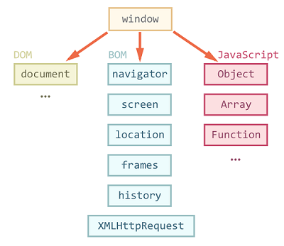

# CH_10 웹 브라우저를 다루는 방법, 블우저 객체 모델 (BOM)
## 10-1 브라우저 객체 모델이란?
브라우저 객체 모델(Browser Object Model)<br>
웹 브라우저 전체를 객체로 관리하는 것

문서 객체 모델(DOM)<br>
웹 문서에 삽입된 각 요소를 각체로 인식하고 조작하는것

자주 사용하는 브라우저 내장 객체<br>
- Window : 브라우저 창이 열릴 때마다 하나씩 만들어지는 객체(최상위 객체)
- Document : 웹 문서에서 body 태그를 만나면 만들어지는 객체
- History : 현재 창에서 사용자의 방문 기록을 저장하고 있는 객체
- Location : 현재 페이지에 대한 URL 정보를 가지고 있는 객체
- Navigator : 현재 사용중인 웹 브라우저 정보를 가지고 있는 객체
- Screen : 현재 사용 중인 화면 정보를 다루는 객체




## 10-2 웹 브라우저를 제어하는 Window 객체
Window 객체<br>
웹 브라우저의 상태를 제어하는 객체로, 자바스크립트 객체 중 최상위이자 기본이 되는 객체

1. Window 객체의 속성 알아보기
    - innerHeight : 내용 영역의 높이를 나타냄
    - innerWidth : 내용 영역의 너비를 나타냄
    - outerHeight : 브라우저 창의 바깥 높이를 나타냄
    - outerWidth : 브라우저 창의 바깥 너비를 나타냄
    - ...등이 있으며 이하 생략
2. Window 객체의 함수 알아보기
    - alert() : 알림창을 표시
    - prompt() : 프롬프트 창에 입력한 텍스트를 반환
    - open() : 새로운 창을 연다
    - close() : 현재 열려있는 창을 닫는다
    - resizeBy() : 지정한 크기만큼 현재 창 크기를 조절
    - resizeTo() : :동적으로 브라우저 창의 크기를 조절
    - moveBy() : 현재 창을 지정한 크기만큼 이동
    - moveTo() : 현재 창을 지정한 좌표로 이동
    - ...등이 있으며 이하 생략
3. 새창을 여는 open() 함수<br>
    -현재창이나 새탭, 새로운 알림창 등 다양한 형태로 새창을 열 수 있다.
    ```
    open("https://www.daum.net");           //해당 링크로 새창이 열림
    open("https://www.daum.net","_self");   //현재창에 새창이 표시
    open("https://www.daum.net","","left=0, top=0, width=300, heigth=300");
                                        //너비300px, 높이 300px크기로 새창이 열림
    ```
4. 크기를 조절하는 resizeBy(), resizeTO() 함수<br>
    -resizeBy() : 기존창의 너비,높이값에 입력한 값을 더해 브라우저 창의 크기를 새로 지정<br>
    -resizeTo() : 최종크기를 지정하며, 음수값을 사용할 수 없음 
    ```
    let nowWin = window.open(" ", " ", "width =300, height = 30);   //새 알림창
    newWIn.resizeBy(100, 100);      //가로 세로 100px 늘림
    newWIn.resizeBy(-100, -100);    //가로 세로 100px 줄임

    newWin.resizeTo(200, 200);      //가로 세로 200px, 200px 로 지정
    ```
5. 위치를 조절하는 moveBy(), moveTo() 함수<br>
    -moveBy() : 현재위치를 기준으로 가로로 x픽셀, 세로로 x픽셀 옮김<<br>
    -mobeTo() : 화면의 왼쪽 위 모서리를 기준으로 가로로 x픽셀, 세로로 y픽셀 옮김
    ```
    newWin.moveBy(500, 500);    //현재위치에서 가로 500px, 세로500px 이동
    newWin.moveTo(0, 0);        //화면의 가장 왼쪽 위로 이동
    ```
6. 팝업 창 표시 프로그램 만들기 - Window 객체 함수로 팝업 창 띄우기
    -> main.html, popup.html, popup.js 참고


## 10-3 브라우저 정보가 담긴 Navigator 객체
Navigator 객체<br>
- 웹 브라우저와 관련된 정보가 담겨있음
- 현재 웹 문서에 접속한 사용자가 크롬 브라우저를 사용했는지, 익스플로러를 사용했는지, 혹은 모바일로 접속했는지 등의 정보를 알 수 있습니다.

렌더링 엔진<br>
- 브라우저에서 웹 문서를 화면에 표시하기 위해 웹 문서의 태그와 스타일을 해석하는 프로그램
- 브라우저마다 내장된 렌더링 엔진이 다르기 때문에 표준화를 위해 css3속성 앞에 -webkit- or -oz- 등의 접두어(prefix)를 붙여 브라우저에 맞게 렌더링 한다.

브라우저별 랜더링 및 자바스크립트 엔진<br>
<table>
<tr>
    <th>브라우저</th>
    <th>렌더링 엔진</th>
    <th>자바스크립트 엔진</th>
</tr>
<tr>
    <td>크롬</td>
    <td>블링크(Blink)</td>
    <td>V8</td>
</tr>
<tr>
    <td>파이어폭스</td>
    <td>게코(Gecko)</td>
    <td>스파이더몽키</td>
</tr>
<tr>
    <td>익스플로러</td>
    <td>트라이덴트(Trident)</td>
    <td>차크라</td>
</tr>
<tr>
    <td>사파리</td>
    <td>웹킷(Webkit)</td>
    <td>자바스크립트코어</td>
</tr>
<tr>
    <td>오페라</td>
    <td>블링크(Blink)</td>
    <td>V8</td>
</tr>
</table>
-> chrome://version 으로 확인 가능<br><br>

Navigator 객체의 속성 알아보기<br>
- Navigator 객체는 브라우저 버전이나 os 정보를 가지고 있는데 이는 사용자가 수정할 수 없고 볼 수만 있음<br>
- 객체의 주요 속성들 
    - appCodeName : 브라우저 이름을 문자열로 반환
    - appName : 브라우저 공식이름을 문자열로 반환
    - appVersion : 브라우저 버전을 문자열로 반환
    - battery : 배터리 충전 상태를 알려주는 정보가 담긴 객체를 반환
    - connection : 브라우저 장치의 네트워크 정보가 담긴 객체를 반환
    - cookieEnabled : 쿠키 정보를 무시한다면 false, 그렇지 않으면 true를 반환
    - geolocation : 모바일 기기를 사용한 위치 정보가 담긴 객체를 반환
    - maxTouchPoints : 장치에서 동시에 터치 가능한 포인트가 몇개인지 반환
    - platform : 브라우저 플랫폼 정보를 가지고 있는 문자열을 반환
    - userAgent : 현재 브라우저 저보가 있는 사용자 에이전트(User Agent)문자열을 반환

사용자 에이전트 문자열로 자바스크립트 엔진 확인하기<br>
- 클라이언트에서 서버로 정보를 보낼 때 클라이언트에서 함께 보내는 정보로, 서버에서는 이정보를 보고 브라우저 종류를 확인한 후 그 브라우저에 맞게 웹 페이지를 표시한다
- navigator.userAgent 에 포함되어있음
- 웹 브라우저의 사용자 에이전트 문자열
    ```
    -익스플로러
      Mozilla/5.0 (Windows NT 6.1; WOW64; Trident/7.0; AS; rv:11.0) like Gecko
    -엣지
      Mozilla/5.0 (Windows NT 10.0; Win64; x64) AppleWebKit/537.36 (KHTML, like Gecko) Chrome/70.0.3538.77 Safari/537.36
    -크롬
      Mozilla/5.0 (Windows NT 10.0; Win64; x64) AppleWebKit/537.36 (KHTML, like Gecko) Chrome/70.0.3538.77 Safari/537.36
    -사파리, 오페라
      Mozilla/5.0 (Macintosh; Intel Mac OS X 10_9_3) AppleWebKit/537.75.14 (KHTML, like Gecko) Version/7.0.3 Safari/7046A194A
    ```


## 10-4 그 밖의 브라우저 객체
1. History 객체 간단히 살펴보기<br>
  - 브라우저에서 뒤로, 앞으로 또는 주소 표시줄에 입력해서 돌아다녔던 사이즈 주소가 저장되어 있다.
  - 보안문제떄문에 읽기 전용
  - History 객체의 속성과 함수
    <table>
    <tr>
    <th>속성</th>
    <th>설명</th>
    </tr>
    <tr>
    <td>length</td>
    <td>현재 브라우저 창의 History 목록에 있는 항목의 개수, 즉 방문한 사이트 개수를 반환</td>
    </tr>
    </table><br><br>

    <table>
    <tr>
    <th>함수</th>
    <th>설명</th>
    </tr>
    <tr>
    <td>back()</td>
    <td>History 목록에서 이전 페이지를 현재 화면에 불러옴</td>
    </tr>
    <tr>
    <td>forward()</td>
    <td>History 목록에서 다음 페이지를 현재 화면에 불러옴</td>
    </tr>
    <tr>
    <td>go()</td>
    <td>History 목록에서 현재 페이지를 기준으로 상대 위치에 있는 페이지를 현재화면에 불러옴 (history.go(1) : 다음페이지/ history.go(-1) : 이전페이지)</td>
    </tr>
    </table><br>

2. Location 객체 간단히 살펴보기<br>
  - 브라우저 주소 표시줄과 관련이 있으며, 현재문서의 URL 주소정보를 가지고있음
  - 편집시 브라우저 창에 열릴 사이트나 문서를 지정할 수 있다
  - Location 객체의 속성과 함수
    <table>
    <tr>
    <th>속성</th>
    <th>설명</th>
    </tr>
    <tr>
    <td>hash</td>
    <td>URL 중 #으로 시작하는 해시 부분을 나타냄</td>
    </tr>
    <tr>
    <td>host</td>
    <td>URL의 호스트 이름과 포트번호를 나타냄</td>
    </tr>
    <tr>
    <td>hostname</td>
    <td>URL의 호스트 이름을 나타냄</td>
    </tr>
    <tr>
    <td>href</td>
    <td>전체 URL</td>
    </tr>
    <tr>
    <td>pathname</td>
    <td>URL 경로를 나타냄</td>
    </tr>
    <tr>
    <td>port</td>
    <td>URL의 포트번호를 나타냄</td>
    </tr>
    <tr>
    <td>protocol</td>
    <td>http:// 나 ftp:// 같은 URL의 프로토콜을 나타냄</td>
    </tr>
    <tr>
    <td>password</td>
    <td>도메인 이름 앞에 username과 password를 함께 입력해서 접속하는 URL일 경우 password 정보를 저장</td>
    </tr>
    <tr>
    <td>search</td>
    <td>URL 중 ? 로 시작하는 검색 내용 부분을 나타냄</td>
    </tr>
    <tr>
    <td>username</td>
    <td>도메인 이름 앞에 usernamer을 함께 입력해서 접속하는 사이트 URL일 경우 username 정보를 저장</td>
    </tr>
    </table><br><br>

    <table>
    <tr>
    <th>함수</th>
    <th>설명</th>
    </tr>
    <tr>
    <td>assign()</td>
    <td>현재 문서에 새 문서 주소를 할당해 새문서를 가져옴</td>
    </tr>
    <tr>
    <td>reload()</td>
    <td>현재 문서를 다시 불러옴(새로고침)</td>
    </tr>
    <tr>
    <td>replace()</td>
    <td>현재 문서의 URL을 지우고 다른 URL로 교체</td>
    </tr>
    <tr>
    <td>toString</td>
    <td>현재 문서의 URL을 문자열로 반환</td>
    </tr>
    </table><br>

3. Screen 객체 간단히 살펴보기<br>
  - 주로 화면정보를 알아낼때 많이 사용하는 객체
  - Screen 객체의 속성과 함수
    <table>
    <tr>
    <th>속성</th>
    <th>설명</th>
    </tr>
    <tr>
    <td>availHeight</td>
    <td>화면에서 윈도우의 작업 표시줄이나 맥의 메뉴/독 같은 UI영역을 제외한 부분의 높이를 나타냄</td>
    </tr>
    <tr>
    <td>availWidth</td>
    <td>Ui 영역을 제외한 부분의 넓이를 나타냄</td>
    </tr>
    <tr>
    <td>ColorDepth</td>
    <td>화면상에서 픽셀을 랜더링할 떄 사용하는 색상의 수를 나타냄</td>
    </tr>
    <tr>
    <td>height</td>
    <td>UI 영역을 포함한 화면의 높이를 나타냄</td>
    </tr>
    </table><br>

    <table>
    <tr>
    <th>함수</th>
    <th>설명</th>
    </tr>
    <tr>
    <td>lockOrientation()</td>
    <td>화면 방향을 잠금</td>
    </tr>
    <tr>
    <td>unlockOrientation()</td>
    <td>화면 방향 잠금을 해제</td>
    </tr>
    </table><br>

🚨주의할점<br>
Windw 객체의 innerWidth, innerHeight, outerWidth, outerHeight 의 속성은 웹 브라우저 창의 넓이나 높이를 측정<br>
Screen 객체의 availWidth, availHeight 의 속성은 화면자체의 넓이나 높이를 측정<br>
->창의 크기를 늘리거나 줄였을 떄, window 객체의 속성값은 바뀌나, Screen 객체의 속성값은 바뀌지 않음